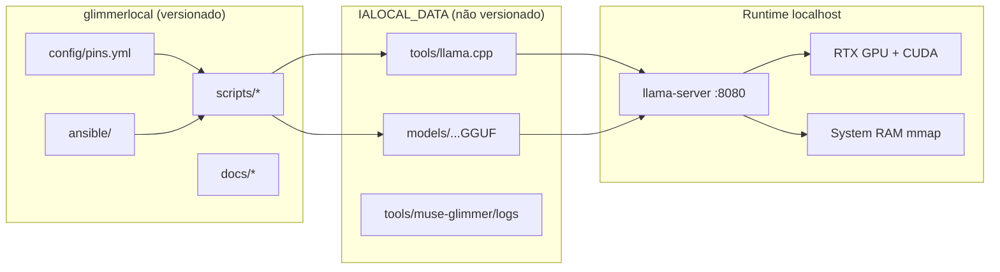

# Arquitetura — glimmerlocal / Muse Glimmer

## Objetivo

Provisionar de forma **reproduzível** um servidor OpenAI-compatible local (`llama-server`) com pesos oficiais Muse Glimmer 30B GGUF, otimizado para workstation com GPU consumer e muita RAM.

## Componentes

| Componente | Fonte | Pin |
|---|---|---|
| Runtime | `ggml-org/llama.cpp` | `config/pins.yml` → `llama_cpp.ref` |
| Modelo texto | `meta-models/Muse-Glimmer-30B-GGUF` / `kquant-17gb` | SHA-256 em `inventory/checksums.sha256` |
| Visão (opcional) | `mmproj-kquant.gguf` | idem |
| Orquestração | Ansible role `muse_glimmer` | playbook `site.yml` |

## Decisões de desenho

1. **Híbrido GPU/RAM** via `--fit on` quando VRAM < tamanho do GGUF (~17 GB).
2. **KV q8_0** para caber mais camadas/contexto em 8 GB.
3. **Bind `127.0.0.1`** + CORS localhost — sem exposição de rede por padrão.
4. **Visão desligada por default** (`MUSE_VISION=0`) para maximizar camadas na GPU.
5. **Pesos fora do Git** — apenas checksums e pins versionados.
6. **Build CUDA com `-j6`** — evita crash do `cicc` sob paralelismo alto (observado neste host).

## Contratos de API

- Health: `GET /health`
- Models: `GET /v1/models`
- Chat: `POST /v1/chat/completions` (alias `muse-glimmer-30B`)
- Obrigatório: template Jinja do GGUF; não parar em `<|eom|>`.

## Limites conhecidos

- Full-GPU (sem offload CPU) requer ≥24 GB VRAM para o kquant-17gb.
- Ollama no Linux/NVIDIA ainda era secundário na data de validação; este stack usa llama.cpp.
