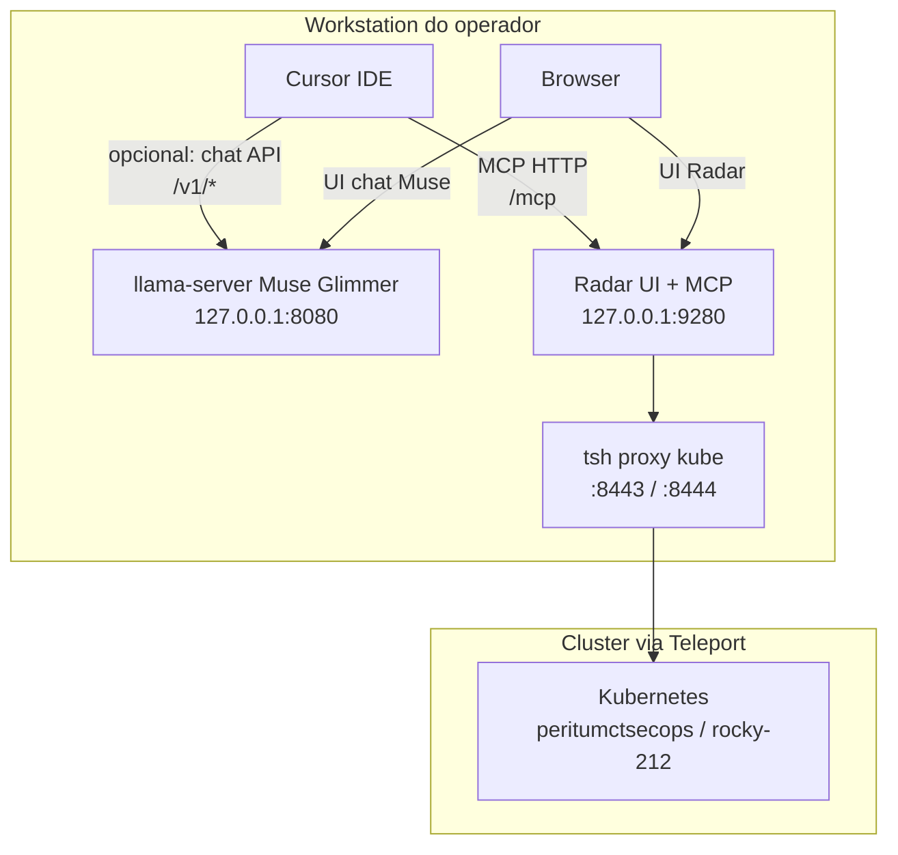
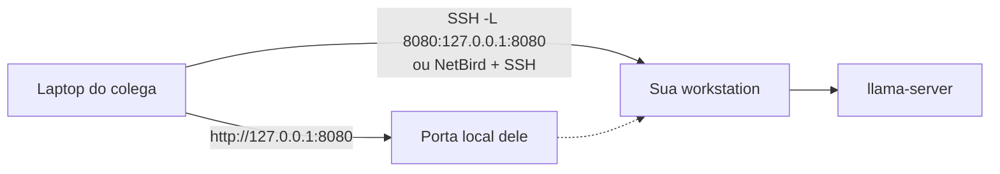

# Guia didático — MCP Radar e compartilhamento do Muse Glimmer

Este documento ensina, do zero ao operacional, como:

1. **Usar o MCP Radar** no Cursor (ferramentas Kubernetes via Model Context Protocol).
2. **Usar o Muse Glimmer local** (UI + API OpenAI-compatible).
3. **Compartilhar o acesso ao modelo** com segurança (colega na mesma rede / laptop remoto), sem abrir a API à Internet sem controles.

Público: operadores DevSecOps PeritumCT na workstation validada (RHEL + NVIDIA + Teleport).

---

## Mapa mental (leia isto primeiro)

Há **dois serviços locais distintos**. Não misture as portas.



| Serviço | Porta | Função | Quem consome |
|---|---|---|---|
| **Radar** | `9280` | UI K8s + **MCP** (`/mcp`) | Cursor (tools), browser |
| **Muse Glimmer** | `8080` | LLM local (chat + API) | Browser, scripts, IDEs, colegas via túnel |

- **MCP** = o Cursor (ou outro agente) chama *ferramentas* no Radar (`list_namespaces`, `diagnose`, …).
- **Modelo** = o LLM gera texto; **não** é o MCP. Você pode usar o Muse *com* o MCP no mesmo Cursor: o agente pensa no Muse (ou no modelo cloud do Cursor) e age no cluster via Radar.

---

## Parte 1 — O que é MCP (didática)

### 1.1 Ideia em uma frase

**MCP (Model Context Protocol)** é um contrato HTTP/JSON-RPC para o assistente de IA **descobrir e chamar ferramentas** de forma estruturada, em vez de só “conversar”.

### 1.2 Fluxo típico no Cursor

1. Você configura um servidor MCP em `~/.cursor/mcp.json`.
2. O Cursor conecta, autentica se necessário, e lista as tools.
3. Em um chat Agent, o modelo decide chamar uma tool (ex.: `diagnose`).
4. O Radar executa a tool com o `kubeconfig` local (Teleport) e devolve JSON.
5. O modelo usa o resultado para responder ou chamar outra tool.

### 1.3 O que o MCP Radar **não** é

- Não substitui `kubectl` para tudo (mas cobre a maior parte das operações de diagnóstico).
- Não é Radar Cloud (proibido neste ambiente).
- Não expoe o cluster na Internet: escuta só em `127.0.0.1`.

Normativo Teleport/Radar:  
[GUIA_ACESSO_OPERADOR_TELEPORT_KUBE_RADAR.md](../../peritumct-sec-platform/docs/implementacao/teleport/GUIA_ACESSO_OPERADOR_TELEPORT_KUBE_RADAR.md)  
Quickref: [examples/radar/README.md](../../peritumct-sec-platform/examples/radar/README.md)

---

## Parte 2 — Preparar o Radar (pré-requisito do MCP)

### 2.1 Subir Teleport + Radar (recomendado)

Na raiz de `peritumct-sec-platform`:

```bash
./scripts/connect-teleport-kube-radar.sh all
# UI:  http://127.0.0.1:9280/
# MCP: http://127.0.0.1:9280/mcp
```

Validação rápida:

```bash
curl -fsS -o /dev/null -w "%{http_code}\n" http://127.0.0.1:9280/
# esperado: 200

curl -fsS http://127.0.0.1:9280/mcp \
  -H 'Content-Type: application/json' \
  -H 'Accept: application/json, text/event-stream' \
  -d '{"jsonrpc":"2.0","id":1,"method":"initialize","params":{"protocolVersion":"2024-11-05","capabilities":{},"clientInfo":{"name":"doc","version":"0"}}}'
# esperado: serverInfo.name = "radar"
```

### 2.2 Atalho gráfico

```bash
./examples/radar/install-desktop-shortcut.sh --desktop
```

### 2.3 Se o MCP falhar no Cursor

| Sintoma | Causa comum | Ação |
|---|---|---|
| Server `error` / tools só `mcp_auth` | Sessão MCP não autenticada ou Radar down | Subir Radar; no Cursor, autenticar o servidor |
| `ERR_CONNECTION_REFUSED` :9280 | Radar parado / proxy Teleport caiu | `./scripts/connect-teleport-kube-radar.sh all` |
| Tools vazias / cluster errado | Context kube errado | Conferir dropdown no UI; `tsh kube ls` |
| Auth loop | Cookie/sessão MCP | Reautenticar; reiniciar Cursor se preciso |

---

## Parte 3 — Configurar MCP no Cursor

### 3.1 Arquivo de configuração

Caminho: `~/.cursor/mcp.json`

Estado validado nesta estação:

```json
{
  "mcpServers": {
    "radar": {
      "url": "http://localhost:9280/mcp"
    }
  }
}
```

Notas:

- O Cursor pode mostrar o servidor como `user-radar` na UI interna.
- Use `localhost` ou `127.0.0.1` — ambos apontam ao Radar local.
- **Não** aponte para Radar Cloud.

### 3.2 Autenticação

Na primeira utilização (ou após falha de discovery):

1. Abra **Cursor Settings → MCP**.
2. Localize o servidor `radar` / `user-radar`.
3. Se pedir autenticação, confirme (fluxo `mcp_auth`).
4. Status esperado: **ready** (não `error` / `needsAuth`).

### 3.3 Como usar no dia a dia (didática)

**Bom prompt (orienta o agente a usar MCP):**

> Liste os namespaces do cluster e diga se `triagemcda` e `trust` estão Active. Use as tools do Radar.

**Diagnóstico:**

> O deployment X no namespace Y está CrashLooping. Use `diagnose` e resuma a causa com evidência dos logs.

**Inventário seguro (read-only):**

> Use `list_resources` / `issues` para listar problemas high/critical em `monitoring` sem alterar nada.

**Evite:**

> “Aplica este YAML em produção” sem `dry_run=true` e sem revisão humana — `apply_resource` é mutação.

### 3.4 Catálogo de tools (mapa didático)

Ferramentas principais do Radar MCP (versão observada ~1.9.x). Nomes exatos vêm da discovery.

| Família | Tools (exemplos) | Quando usar |
|---|---|---|
| Descoberta | `list_namespaces`, `list_resources`, `search` | Orientar-se no cluster |
| Inspeção | `get_resource`, `get_events`, `get_pod_logs`, `get_workload_logs` | Ver um objeto/logs |
| Diagnóstico | `diagnose`, `issues`, `get_neighborhood`, `get_topology` | Incidentes / CrashLoop / rota |
| Observabilidade | `query_prometheus`, `discover_metrics`, `get_prometheus_rules`, `top_resources` | Métricas / regras |
| GitOps / Helm | `list_helm_releases`, `get_helm_release`, `manage_gitops` | Sync/health Argo/Flux/Helm |
| Mutação (cuidado) | `apply_resource`, `patch_resource`, `manage_workload`, `manage_cronjob`, `manage_node` | Só com intenção explícita + RBAC |

Princípios:

1. Prefira **read-only** até ter hipótese clara.
2. Para writes: `dry_run=true` primeiro; `force=true` só se souber o que é field ownership.
3. O RBAC efetivo é o do seu usuário Teleport — MCP não bypassa o cluster.

### 3.5 Exemplo ponta a ponta (mental)

```text
Você → Cursor Agent
       → tool list_namespaces
       → Radar MCP :9280
       → kubeconfig merged (Teleport)
       → API Kubernetes
       → JSON de namespaces
       → Agent resume em português
```

Smoke já validado nesta estação: `list_namespaces` retornou namespaces da plataforma (`argocd`, `trust`, `triagemcda`, `falco`, …).

---

## Parte 4 — Usar o Muse Glimmer local (o modelo)

### 4.1 O que está rodando

| Item | Valor tipico nesta estação |
|---|---|
| Serviço systemd | `muse-glimmer.service` (user) |
| URL UI | http://127.0.0.1:8080/ |
| API OpenAI-compatible | http://127.0.0.1:8080/v1/ |
| Health | `GET /health` |
| Models | `GET /v1/models` → alias `muse-glimmer-30B` |
| Perfil atual (perf) | `perf-q3` (Unsloth Q3 + ngram) — ver [PERFORMANCE.md](PERFORMANCE.md) |
| Perfil fidelidade Meta | `baseline` / `perf` com kquant-17gb |

### 4.2 Operação básica

```bash
# status
systemctl --user status muse-glimmer.service
curl -fsS http://127.0.0.1:8080/health

# reiniciar / trocar perfil
cd /run/media/petterlopes/SSD930/devsec/peritumct/glimmerlocal
./scripts/restart-with-profile.sh perf-q3    # velocidade
./scripts/restart-with-profile.sh baseline   # pin oficial Meta

# instalar persistência (se ainda não)
./scripts/install-systemd-user.sh
```

### 4.3 Chat no browser

1. Abra http://127.0.0.1:8080/  
2. Use o alias `muse-glimmer-30B`.  
3. Ajuste `reasoning_strength` (low/medium/high) conforme latência vs qualidade.

### 4.4 API (para scripts e outros clientes)

```bash
curl -sS http://127.0.0.1:8080/v1/chat/completions \
  -H 'Content-Type: application/json' \
  -d '{
    "model": "muse-glimmer-30B",
    "messages": [{"role":"user","content":"Responda só: OK"}],
    "max_tokens": 64,
    "chat_template_kwargs": {"reasoning_strength": "low"}
  }'
```

Parâmetros úteis:

| Campo | Uso |
|---|---|
| `model` | `muse-glimmer-30B` |
| `messages` | chat padrão OpenAI |
| `max_tokens` | limite de saída |
| `chat_template_kwargs.reasoning_strength` | `low` / `medium` / `high` / `xhigh` |
| `temperature` / `top_p` / `top_k` | defaults Meta: 1.0 / 0.95 / 64 |

### 4.5 Conectar outro app na **mesma máquina**

Qualquer cliente OpenAI-compatible:

| App | Base URL | API key |
|---|---|---|
| Continue / Open WebUI / LiteLLM | `http://127.0.0.1:8080/v1` | qualquer string se não houver key; ou a key configurada |
| Cursor (modelo custom HTTP) | idem | idem |
| Python `openai` SDK | `base_url="http://127.0.0.1:8080/v1"` | `api_key="local"` |

Exemplo Python:

```python
from openai import OpenAI
client = OpenAI(base_url="http://127.0.0.1:8080/v1", api_key="local")
r = client.chat.completions.create(
    model="muse-glimmer-30B",
    messages=[{"role": "user", "content": "Olá"}],
    max_tokens=128,
)
print(r.choices[0].message.content)
```

---

## Parte 5 — Compartilhar o acesso ao modelo (seguro)

### 5.1 Princípio

Por padrão o Muse **só escuta em `127.0.0.1`**. Isso é proposital:

- Colega na mesma LAN **não** alcança `:8080`.
- Para compartilhar, use **túnel autenticado** + **API key**, nunca `0.0.0.0` sem autenticação.



### 5.2 Opção A — SSH local forward (recomendada para 1:1)

No **laptop do colega** (com conta SSH na sua workstation):

```bash
ssh -N -L 8080:127.0.0.1:8080 usuario@IP_DA_WORKSTATION
```

Depois, no browser/IDE do colega:

- UI: http://127.0.0.1:8080/  
- API: http://127.0.0.1:8080/v1  

O tráfego fica criptografado no SSH; o Muse continua bind localhost.

Checklist:

1. Conta SSH com chave (sem senha fraca).  
2. Firewall da workstation: só SSH (e NetBird, se houver), **não** liberar 8080/9280 na LAN.  
3. Combinar horário: o `muse-glimmer.service` precisa estar `active`.  
4. Avisar que **uma GPU** atende poucas sessões — Q3 hybrid ~6–7 t/s; concorrência degrada.

### 5.3 Opção B — NetBird / overlay + SSH

Se ambos estão no overlay PeritumCT:

```bash
ssh -N -L 8080:127.0.0.1:8080 usuario@nome-netbird-da-workstation
```

Mesma regra: **não** publicar o llama-server direto no overlay sem ADR/API key.

### 5.4 Opção C — API key no Muse (obrigatória se sair de localhost)

Antes de qualquer bind não-localhost:

```bash
mkdir -p /run/media/petterlopes/SSD930/devsec/peritumct/glimmerlocal/secrets
chmod 700 /run/media/petterlopes/SSD930/devsec/peritumct/glimmerlocal/secrets
openssl rand -base64 32 > /run/media/petterlopes/SSD930/devsec/peritumct/glimmerlocal/secrets/api-key
chmod 600 /run/media/petterlopes/SSD930/devsec/peritumct/glimmerlocal/secrets/api-key
```

Adicione ao unit systemd (drop-in) ou ao script de start a flag do `llama-server`:

```text
--api-key "$(cat .../secrets/api-key)"
```

Cliente:

```bash
curl -sS http://127.0.0.1:8080/v1/models \
  -H "Authorization: Bearer $(cat .../secrets/api-key)"
```

Compartilhe a key por canal seguro (1Password / bitwarden / conversa cifrada) — **nunca** commit no Git.

### 5.5 O que **não** fazer

| Prática | Por quê |
|---|---|
| `MUSE_HOST=0.0.0.0` sem API key | Qualquer host na rede usa seu GPU/modelo |
| Liberar 8080 no firewall “só um tempinho” | Scanners e laterais |
| Compartilhar MCP Radar (`9280`) via túnel sem cuidado | É **poder no cluster** (RBAC Teleport do *seu* usuário) |
| Colar kubeconfig / api-key em ticket/chat | Vazamento de credencial |
| Ligar `--agent` / tools irrestritas no llama-server | RCE via prompt injection |

### 5.6 Compartilhar MCP Radar? (aviso forte)

Compartilhar `:9280/mcp` equivale a dar ao colega as **mesmas permissões Kubernetes da sua sessão Teleport**.

Só faça se:

1. Túnel SSH igual ao do modelo, **e**
2. O colega já teria o mesmo acesso via `tsh`, **e**
3. Há acordo explícito de operação (sem writes sem revisão).

Para a maioria dos casos: **compartilhe só o modelo (`:8080`)**, não o MCP.

### 5.7 Modelo “sala de aula” (vários colegas)

1. Um horário agendado.  
2. Um operador “dono” da GPU.  
3. Cada colega com SSH tunnel próprio.  
4. API key rotacionada no fim do dia.  
5. Profile `perf-q3` para latência; avisar qualidade ≠ pin Meta.  
6. Não misturar cargas pesadas (treino / builds CUDA) na mesma máquina.

---

## Parte 6 — Usar MCP + Muse juntos (fluxo completo)

Cenário útil: **Cursor Agent** com MCP Radar, enquanto você (ou o time) usa o Muse na UI para redigir runbooks.

```text
[Cursor] ──MCP──► Radar ──Teleport──► Cluster   (ações / fatos)
[Browser] ──API──► Muse Glimmer                 (redação / brainstorm)
```

Se no futuro o Cursor apontar um endpoint HTTP custom para o Muse:

1. Base URL `http://127.0.0.1:8080/v1`  
2. Model id `muse-glimmer-30B`  
3. MCP Radar continua em `9280` — independente do LLM escolhido  

O agente pode então: raciocinar com Muse **e** chamar `diagnose` no Radar no mesmo turno (quando o produto Cursor estiver configurado com ambos).

---

## Parte 7 — Troubleshooting rápido

### Muse (`:8080`) — Connection refused

```bash
systemctl --user status muse-glimmer.service
systemctl --user restart muse-glimmer.service
# ou
cd .../glimmerlocal && ./scripts/install-systemd-user.sh
curl -fsS http://127.0.0.1:8080/health
```

Causa frequente: processo iniciado só no shell do Cursor e morto ao encerrar a sessão. Use **systemd user**.

### Radar / MCP (`:9280`)

```bash
./scripts/connect-teleport-kube-radar.sh all status
./scripts/connect-teleport-kube-radar.sh all   # sobe de novo
# Cursor → Settings → MCP → reauth se necessário
```

### Túnel do colega não abre o chat

1. `ssh -N -L ...` ainda ativo?  
2. Health no **lado dele**: `curl http://127.0.0.1:8080/health`  
3. API key correta?  
4. CORS: UI do Muse em outro host pode falhar; preferir abrir UI via o mesmo túnel (`127.0.0.1:8080` no cliente).

### Lento (~4–7 t/s)

Normal em RTX 4060 8GB (hybrid). Ver [PERFORMANCE.md](PERFORMANCE.md). Não é falha do túnel.

---

## Parte 8 — Checklists

### Operador (só local)

- [ ] `tsh status` OK  
- [ ] Radar UI http://127.0.0.1:9280/  
- [ ] Cursor MCP `radar` = ready  
- [ ] `systemctl --user is-active muse-glimmer` = active  
- [ ] http://127.0.0.1:8080/health = ok  

### Compartilhar modelo com 1 colega

- [ ] Muse ativo (systemd)  
- [ ] Conta SSH do colega  
- [ ] Túnel `-L 8080:127.0.0.1:8080`  
- [ ] (Recomendado) API key criada e enviada com segurança  
- [ ] Combinado: sem opens de 8080 na LAN  
- [ ] Aviso de performance / fila na GPU  

### Encerrar compartilhamento

- [ ] Colega fecha o SSH  
- [ ] Rotaciona API key (se usada)  
- [ ] Opcional: `systemctl --user stop muse-glimmer` fora do expediente  

---

## Referências internas

| Doc | Assunto |
|---|---|
| [ARCHITECTURE.md](ARCHITECTURE.md) | Stack Muse / llama.cpp |
| [RUNBOOK.md](RUNBOOK.md) | Operar / perfis |
| [PERFORMANCE.md](PERFORMANCE.md) | A/B tok/s, perf-q3 |
| [SECURITY.md](SECURITY.md) | Controles Muse |
| [examples/radar/README.md](../../peritumct-sec-platform/examples/radar/README.md) | Radar + Teleport |
| Guia normativo Teleport | `peritumct-sec-platform/docs/implementacao/teleport/GUIA_ACESSO_OPERADOR_TELEPORT_KUBE_RADAR.md` |

---

## Glossário curto

| Termo | Significado |
|---|---|
| MCP | Protocolo de tools para agentes |
| Radar | UI + servidor MCP Kubernetes (skyhook-io) |
| Muse Glimmer | LLM 30B local (Meta / Unsloth GGUF) |
| llama-server | Runtime OpenAI-compatible (llama.cpp) |
| Hybrid offload | Parte do modelo na GPU, parte na RAM/CPU |
| perf-q3 | Perfil rápido (Q3 + ngram) nesta workstation |
| baseline | Perfil fidelidade (Meta kquant-17gb) |
