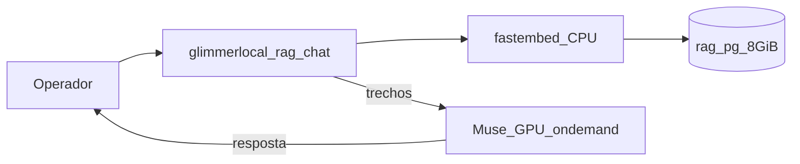

# Integração RAG ↔ glimmerlocal (Muse) — cascata R1→R4

| | |
|---|---|
| **Data** | 2026-08-12 |
| **SoT Postgres** | `peritumct-sec-platform/rag/` (não duplicado aqui) |
| **SoT LLM** | Muse Glimmer (`llama-server`, on-demand) |
| **Bridge** | `scripts/rag-*.sh` · `config/rag-bridge.env` |

Cada secção é mais ampla e profunda que a anterior.

---

## R1 — Âmbito e contrato

### Problema

Muse sozinho = modelo sem âncora documental. RAG sozinho = retrieve sem redacção. Falta o hop **retrieve → `/v1/chat/completions`**.

### Contrato (hard)

| Regra | Valor |
|-------|--------|
| Postgres | Só plataforma (`127.0.0.1:5433` / Teleport) |
| Role chat | **`rag_query`** (nunca `rag` admin) |
| Corpus | Literatura / protocolo — **zero PII processual** |
| LLM | **Só Muse** local |
| Memória RAG | cgroup **8 GiB** |
| Muse | **On-demand** (menu Admin / `muse-adminctl`) |

### Achados R1

| ID | Sev. | Achado |
|----|------|--------|
| R1-01 | Alta | `agents.run_query` para no prompt (`answer=None`) |
| R1-02 | Alta | Duplicar Podman RAG no glimmerlocal = drift de secrets/TLS |
| R1-03 | Info | Terminal: Muse health OK · ~5,3 GiB VRAM · ~1,7 GiB livres (FIT 1536) |

---

## R2 — Superfície segura (mais ampla)



### Artefactos glimmerlocal

| Path | Papel |
|------|--------|
| `config/rag-bridge.env.example` | Template (sem passwords) |
| `scripts/lib/rag-bridge.sh` | Source `rag.env` plataforma + Muse |
| `scripts/rag-status.sh` | Health RAG + Muse |
| `scripts/rag-query.sh` | Proxy `python -m agents.run_query` |
| `scripts/rag-chat.sh` / `rag-chat.py` | Retrieve → Muse chat + `log_run` |

### Achados R2

| ID | Sev. | Mitigação |
|----|------|-----------|
| R2-01 | Crítica | Passwords só em `rag/secrets/rag.env` |
| R2-02 | Alta | `PGSSLMODE=disable` local com TLS Teleport no servidor |
| R2-03 | Média | `--ensure-muse` arranca serviço só se health DOWN |
| R2-04 | Média | Menu Admin expõe status RAG sem abrir DSN |

---

## R3 — Qualidade e dados (mais profunda)

### Fluxo de dados

1. Router (`agents.router`) → domínio/agente  
2. Embed 1024-d (`fastembed` / BGE-large)  
3. `rag_hybrid_search` → chunks + RRF  
4. `build_prompt` (system + trechos + pergunta)  
5. Muse `POST /v1/chat/completions`  
6. `agent_runs.answer` (metadados retrieve; pergunta sem PII)

### Métricas sugeridas

| Métrica | Alvo |
|---------|------|
| Citation coverage (páginas no texto) | ≥1 por resposta |
| Latency p95 retrieve+Muse | orçamento GPU |
| Score fidelity | N/A (sem CDA neste bridge) |
| RAG mem | ≤ 8 GiB cgroup |

### Achados R3

| ID | Sev. | Achado |
|----|------|--------|
| R3-01 | Alta | Um agente (`--max-agents 1`) reduz latência no chat interactivo |
| R3-02 | Média | Domínio `forense-protocolo` ainda em roadmap EvoNexus |
| R3-03 | Info | Bridge local = protótipo; EvoNexus versiona skill forense |

---

## R4 — Aceite e anti-padrões (mais profunda)

### Aceite

| # | Critério |
|---|----------|
| 1 | `./scripts/rag-status.sh` → domains + Muse health |
| 2 | `./scripts/rag-chat.sh -q "…" --ensure-muse` → resposta com trechos |
| 3 | `podman inspect rag-pg` Memory = 8 GiB |
| 4 | Muse boot = **disabled**; start só via Admin/CLI |
| 5 | Zero INSERT em `documents`/`chunks` no caminho chat |

### Anti-padrões

| Não | Sim |
|-----|-----|
| Copiar `secrets/rag.env` para glimmerlocal Git | Source via `RAG_ENV_FILE` |
| Autostart Muse + RAG no login | On-demand Muse; RAG cgroup limitado |
| Cloud LLM | Muse only |
| Depoimento no `-q` | Só perguntas de literatura/protocolo |

### SOP — UI Muse (MCP)

```bash
./scripts/muse-adminctl.sh start
# http://$MUSE_HOST:8080/ → MCP Servers → peritumct-rag (useProxy)
# Doc: docs/REVISAO_MCP_RAG_UI.md
```

### SOP — CLI

```bash
# RAG (uma vez / boot workstation)
cd ../peritumct-sec-platform/rag && ./scripts/podman-up.sh

# Chat com RAG
cd ../glimmerlocal
./scripts/rag-status.sh
./scripts/rag-chat.sh --ensure-muse -q "What are Privacy by Design foundational principles?"
./scripts/muse-adminctl.sh stop   # libertar VRAM
```

### Referências plataforma

- `docs/implementacao/rag/ACESSO.md`
- `docs/implementacao/rag/INTEGRACAO_EVONEXUS.md`
- `docs/REVISAO_ONDEMAND_RAG_PERF.md`
- `docs/implementacao/radar/REVISAO_RENDER_LOCAL_VRAM.md`
