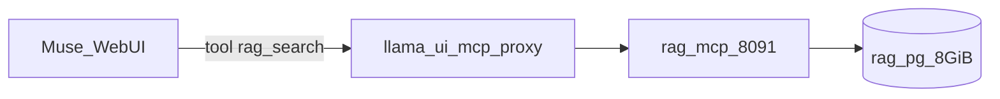

# Consumir RAG pela UI Muse — cascata R1→R4 (MCP)

| | |
|---|---|
| **Data** | 2026-08-12 |
| **UI** | `http://100.74.1.232:8080/` (llama.cpp WebUI) |
| **MCP** | `http://127.0.0.1:8091/mcp` (streamable-http, loopback) |
| **CLI** | `scripts/rag-chat.sh` (alternativa sem tools) |

Cada secção é mais ampla e profunda que a anterior.

---

## R1 — Problema e âmbito

A WebUI Muse **não** embute o Postgres RAG. O menu **MCP Servers** é um cliente MCP no browser; o path `/mcp` em `:8080` é 404 (não é Radar nem RAG).

| Canal | O que é |
|-------|---------|
| Muse `:8080` chat | Só LLM |
| `muse…/mcp` (plataforma) | **Radar** K8s |
| `127.0.0.1:8091/mcp` | **RAG** Postgres (este doc) |
| `rag-chat.sh` | Bridge CLI retrieve→chat |

**Achado R1-01 (Alta):** sem servidor MCP RAG + `--ui-mcp-proxy`, a UI não consegue tools de retrieve.

---

## R2 — Controlo de segurança (mais ampla)

| Controlo | Valor |
|----------|--------|
| Bind MCP | **só** `127.0.0.1` (recusa outros hosts) |
| Proxy CORS | `--ui-mcp-proxy` no `llama-server` (não expor 8091 na mesh) |
| Role DB | `rag_query` |
| Corpus | literatura/protocolo — zero PII |
| Autostart Muse | **disabled**; MCP sobe com `muse-adminctl start` |



---

## R3 — Implementação e dados (mais profunda)

| Componente | Path |
|------------|------|
| Servidor MCP | `scripts/rag_mcp_server.py` |
| CTL | `scripts/rag-mcpctl.sh` |
| UI defaults | `config/muse-ui.json` (`peritumct-rag`, `useProxy: true`) |
| Flags Muse | `--ui-mcp-proxy` + `--ui-config-file` via `lib/common.sh` |

Tools MCP:

- `rag_search(question, max_agents?, limit?)` → trechos + prompt citável  
- `rag_domains()` → metadados de agentes  

---

## R4 — Aceite e SOP UI (mais profunda)

### Aceite

| # | Critério |
|---|----------|
| 1 | `rag-mcpctl.sh start` → `/mcp` responde |
| 2 | Muse reiniciado com `--ui-mcp-proxy` + `muse-ui.json` |
| 3 | UI → MCP Servers → **peritumct-rag** enabled + useProxy |
| 4 | Pergunta PbD dispara `rag_search` e cita páginas |
| 5 | `RAG_MCP_HOST=0.0.0.0` é **recusado** |

### SOP — consumir RAG pela UI

```bash
./scripts/muse-adminctl.sh start    # sobe Muse + MCP RAG
# Browser: http://100.74.1.232:8080/
# Sidebar → MCP Servers → peritumct-rag (já em muse-ui.json; editar → useProxy ON)
# New chat → perguntar sobre Privacy by Design / domínio ingerido
./scripts/muse-adminctl.sh stop     # liberta VRAM + para MCP
```

### Anti-padrões

| Não | Sim |
|-----|-----|
| Expor `:8091` no NetBird | Loopback + ui-mcp-proxy |
| Confundir MCP Radar com RAG | URLs distintas |
| Esperar retrieve só com chat vazio | Tool `rag_search` ou `rag-chat.sh` |

Ver também: [INTEGRACAO_RAG.md](INTEGRACAO_RAG.md) · [REVISAO_ONDEMAND_RAG_PERF.md](REVISAO_ONDEMAND_RAG_PERF.md).
