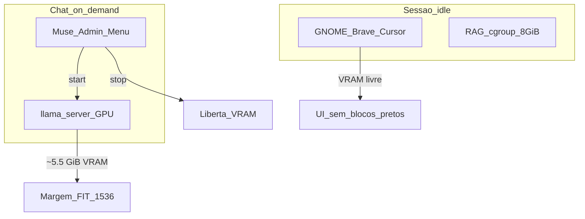

# Revisão cascata — RAG 8 GiB · Muse on-demand · performance local

| | |
|---|---|
| **Data** | 2026-08-12 |
| **Host** | `i9rhel` (i9-14900K · 125 GiB RAM · RTX 4060 8 GiB) |
| **Objectos** | Postgres 18 RAG (Podman) · Muse Glimmer · desktop GNOME/Brave |

Cada secção R1→R4 é mais ampla e profunda que a anterior.

---

## R1 — Âmbito e contratos

### Objectivos

1. **RAG:** envelope cgroup **8 GiB** (não 36 GiB).
2. **Muse:** só corre quando o operador inicia o **serviço de chat** (menu Admin / CLI).
3. **Performance local:** interpretar correctamente VRAM vs RAM vs cluster UI.

### Achados R1

| ID | Sev. | Achado |
|----|------|--------|
| R1-01 | Crítica | `muse-glimmer.service` **enabled** em `default.target` → VRAM ao login |
| R1-02 | Alta | `rag-pg` tinha `--memory=36g` + `shared_buffers=8GB` (incompatível com envelope 8 GiB) |
| R1-03 | Alta | Blocos pretos no Radar = VRAM esgotada pelo Muse, **não** métrica K8s |
| R1-04 | Info | Host RAM (~85 GiB available) não é o bottleneck do sintoma UI |

---

## R2 — Controles aplicados (mais ampla)

### Postgres RAG (Podman)

| Parâmetro | Antes | Depois (SoT) |
|-----------|-------|----------------|
| `--memory` | 36g | **8g** (`RAG_MEMORY_LIMIT`) |
| `--memory-swap` | 2× | **8g** (sem swap extra no cgroup) |
| `--shm-size` | 8g | **2g** |
| `--cpus` | 12 | **4** |
| `shared_buffers` | 8GB | **2GB** (~25% do limite) |
| `effective_cache_size` | 24GB | **6GB** |
| `maintenance_work_mem` | 2GB | **256MB** |
| `max_connections` | 100 | **50** |

Script: `peritumct-sec-platform/rag/scripts/podman-up.sh`.

### Muse Glimmer (on-demand)

| Controlo | Comportamento |
|----------|----------------|
| systemd `--user` | Unit instalada; **`disable` no boot** |
| Menu GNOME | **Muse Glimmer — Administração** (start/stop/restart/status) |
| CLI | `scripts/muse-adminctl.sh {start\|stop\|restart\|status\|vram\|logs}` |
| `MUSE_FIT_TARGET` | **1536** MiB livres (coexistência desktop) |
| Perfil | `config/profiles/desktop-ondemand.env` |

Anti-padrão: `install-systemd-user.sh` a fazer `enable --now` e a sobrescrever `muse-glimmer.env` com `FIT_TARGET=256`.

---

## R3 — Modelo de performance local (mais profunda)



### Inventário típico (idle sem Muse)

| Consumidor | Recurso | Nota |
|------------|---------|------|
| DebianLDA / WinApps VMs | RAM ~24 GiB + ~6 GiB | Não explica blocos pretos |
| Muse (se enabled) | **VRAM ~5–7 GiB** | Causa UI preta |
| RAG 8 GiB | RAM cgroup | Independente da GPU |
| Radar processo | ~300 MiB RSS | Leve |

### Interpretação correcta

| Sintoma | Causa local correcta | Não é |
|---------|----------------------|-------|
| Rectângulos pretos no Radar/Brave | VRAM NVIDIA esgotada | “Layout” do cluster / 8 GiB requests K8s |
| Sessão lenta no login | Muse autostart + VMs | Falha Teleport |
| RAG OOM | Ultrapassar 8 GiB cgroup / buffers mal calibrados | GPU |

---

## R4 — Aceite e operação (mais profunda)

### Aceite

| # | Critério | Evidência |
|---|----------|-----------|
| 1 | `podman inspect rag-pg` → Memory = 8 GiB | `8589934592` |
| 2 | `systemctl --user is-enabled muse-glimmer` → **disabled** | on-demand |
| 3 | Menu «Muse Glimmer Admin» no GNOME | `.desktop` instalado |
| 4 | Após `stop`: VRAM livre ≫ 4 GiB (sem Muse) | `nvidia-smi` |
| 5 | Após `start`: health OK + Free ≥ ~1,2 GiB | FIT 1536 |

### SOP rápido

```bash
# RAG 8 GiB
cd peritumct-sec-platform/rag && ./scripts/podman-up.sh

# Muse — só para chat
cd glimmerlocal
./scripts/install-desktop-admin.sh --desktop   # uma vez
./scripts/muse-adminctl.sh start               # ou menu Admin → Iniciar
./scripts/muse-adminctl.sh stop                # libertar GPU
```

### Won’t

- Autostart Muse no login em workstation partilhada com UI.
- `shared_buffers=8GB` dentro de cgroup 8 GiB.
- Culpar o Radar/Skyhook por artefactos GBM/NVIDIA.

---

## Referências

- `rag/scripts/podman-up.sh`
- `glimmerlocal/scripts/muse-adminctl.sh`
- `glimmerlocal/scripts/muse-admin-menu.sh`
- `docs/implementacao/radar/REVISAO_RENDER_LOCAL_VRAM.md` (plataforma)
